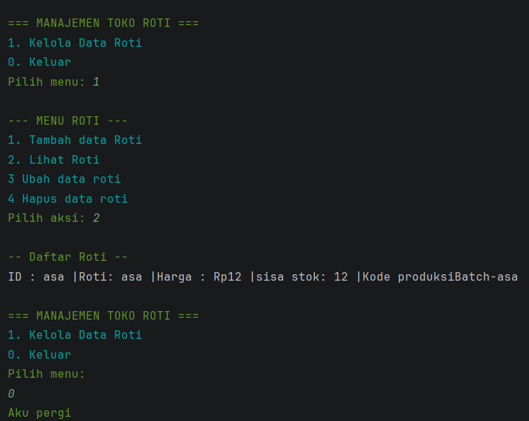

# Sistem Manajemen Toko Roti

> **Nama:** Muhammad Dzaki Rifa’I
>
> **NIM:** 2409106056
>
> **Mata Kuliah:** Pemrograman Berbasis Objek
>
> **Bahasa Pemrograman:** Java

---

## Daftar Isi

1. [Deskripsi Proyek](#deskripsi-proyek)
2. [Struktur Proyek](#struktur-proyek)
3. [Arsitektur & Desain OOP](#arsitektur--desain-oop)
4. [Penjelasan Kelas](#penjelasan-kelas)
5. [Fitur Aplikasi](#fitur-aplikasi)
6. [Alur Program](#alur-program)
7. [Cara Menjalankan](#cara-menjalankan)
8. [Contoh Penggunaan](#contoh-penggunaan)

---

## Deskripsi Proyek

Proyek ini merupakan **Sistem Manajemen Toko Roti** berbasis konsol (CLI) serta sudah menggunakan Jansi sebagai tambahan untuk mempercantik tampilan yang dibangun menggunakan Java. Aplikasi ini memungkinkan pengguna untuk mengelola operasional toko roti secara lengkap, mulai dari persediaan roti di etalase, stok bahan baku di gudang, hingga data member pelanggan.

Proyek ini dibuat sebagai bagian dari praktikum **Post-Test** mata kuliah Pemrograman Berorientasi Objek, dengan fokus pada penerapan konsep dasar OOP seperti **enkapsulasi**, **modularisasi kode**, dan operasi **CRUD** menggunakan ArrayList.

---

## Struktur Proyek

```
POSTTEST_1/
├── src/
│   ├── Main.java          # Kelas Utama (Pusat Kendali & Menu)
│   ├── Roti.java          # Class Roti
│   ├── BahanBaku.java     # Class Bahan Baku
│   └── Pelanggan.java     # Class Pelanggan
├── assets/                
│   └── output_roti.png    # Folder menyimpan gambar output laporan
└── README.md
```

---

## Arsitektur & Desain OOP

Proyek ini menerapkan prinsip-prinsip OOP sebagai berikut:

### Enkapsulasi
Setiap kelas menggunakan modifier `private` serta sudah ditambahkan juga penggunaan `public`, `protected`, serta `Default` pada atributnya untuk keamanan data dan menyediakan akses secara terkontrol melalui method `getter` dan `setter`.

### Modularisasi
Program dipisah menjadi beberapa entitas objek di dunia nyata (Roti, Bahan Baku, Pelanggan) agar kode lebih rapi dan mudah dikelola, tidak menumpuk menjadi satu proses prosedural.\

### Inheritance (Pewarisan)
proyek
ini menerapkan tipe **Hierarchical Inheritance**, di mana sebuah *Superclass* mewariskan atribut dan sifat dasarnya kepada lebih dari satu *Subclass*. Konsep ini diterapkan secara logis berdasarkan relasi *is-a* (Kue Tart adalah sebuah Roti). Penggunaan inheritance mencegah duplikasi redundansi kode dengan memanfaatkan *keyword* `extends` dan `super()`.
---

## Penjelasan Kelas

### 1. `Roti.java`
Merepresentasikan produk roti yang tersedia di etalase toko.

| Atribut         | Tipe     | Keterangan |
|-----------------|----------|---|
| `idroti`        | `String` | ID unik roti (format: `R-xxx`) |
| `namaRoti`      | `String` | Nama varian roti |
| `harga`         | `int`    | Harga jual produk (Rupiah) |
| `stok`          | `int`    | Ketersediaan roti |
| `Kode Produksi` | `String` | Ketersediaan roti |

### 2. `BahanBaku.java`
Merepresentasikan persediaan bahan di dapur/gudang toko.

| Atribut         | Tipe | Keterangan |
|-----------------|---|---|
| `idBahan`       | `String` | ID unik bahan (format: `B-xxx`) |
| `namaBahan`     | `String` | Nama bahan (contoh: Tepung) |
| `kategoriBahan` | `String` | Kategori (Kering/Basah/Topping) |
| `stok`          | `double` | Jumlah ketersediaan bahan |
| `satuanStok`     | `String` | Satuan ukur (Kg, Gram, Liter) |

### 3. `Pelanggan.java`
Merepresentasikan data pelanggan yang terdaftar sebagai member.

| Atribut | Tipe | Keterangan |
|---|---|---|
| `idPelanggan` | `String` | ID unik pelanggan (format: `P-xxx`) |
| `namaPelanggan` | `String` | Nama lengkap pelanggan |
| `noHp` | `String` | Nomor telepon pelanggan |
| `poinMember` | `int` | Poin reward dari hasil belanja |
| `jenisMember` | `String` | Tingkat member (Reguler/Silver/Gold) |

### 4. `Main.java`
Kelas utama yang menjalankan program. Berisi:
- Loop menu utama dan sub-menu .
- 3 buah `ArrayList` sebagai penyimpanan data in-memory untuk masing-masing class.
- Operasi CRUD (Create, Read, Update, Delete) yang menerima input dari Scanner.

---

## Fitur Aplikasi

| No | Fitur | Deskripsi |
|---|---|---|
| 1 | **Tambah Data ** | Input data baru untuk Roti, Bahan Baku, maupun Pelanggan. |
| 2 | **Tampilkan Data ** | Menampilkan daftar seluruh entitas dengan format rapi. |
| 3 | **Update Data Roti** | Memperbarui nama, harga, atau stok roti berdasarkan urutan. |
| 4 | **Hapus Data Roti** | Menghapus data roti dari etalase. |
| 0 | **Keluar** | Mengakhiri program dengan aman. |

---

## Alur Program

```
[Mulai]
    |
    v
[Tampilkan Menu Utama]
    |
    ├── [1] Kelola Roti   → Masuk Sub-Menu Roti (Create, Read, Update, Delete)
    |
    ├── [2] Kelola Bahan  → Masuk Sub-Menu Bahan (Create, Read)
    |
    ├── [3] Kelola Member → Masuk Sub-Menu Pelanggan (Create, Read)
    |
    └── [0] Keluar        → Akhiri program
```

---

## Cara Menjalankan

### Prasyarat
- **Java JDK 8** atau lebih baru sudah terinstal.
- IDE yang direkomendasikan **IntelliJ IDEA**.

### Langkah-langkah
1. Buka IntelliJ IDEA, pilih `File > Open` dan arahkan ke folder proyek ini.
2. Pastikan folder `src` sudah ditandai sebagai *Sources Root*.
3. Buka file `Main.java`.
4. Jalankan program dengan klik kanan di dalam kode dan pilih `Run 'Main.main()'`.
5. Gunakan terminal di bagian bawah IDE untuk berinteraksi dengan menu.

---

## Contoh Penggunaan

```text
=== SISTEM MANAJEMEN TOKO ROTI ===
1. Kelola Data Roti
0. Keluar Program
Pilih menu: 1

--- MENU ROTI ---
1. Tambah data Roti 
2. Lihat Roti 
3. Ubah data Roti 
4. Hapus data Roti 
Pilih aksi: 1

-- Tambah Data Roti --
ID Roti: R-01
Nama Roti: Roti Sobek Cokelat
Harga: 15000
Stok: 20
Data roti telah tertambahkan

--- MENU ROTI ---
1. Tambah data Roti 
2. Lihat Roti 
3. Ubah data Roti 
4. Hapus data Roti 
Pilih aksi: 2

-- Daftar Roti --
1. ID: R-01 | Roti: Roti Sobek Cokelat | Harga: Rp15000 | Stok: 20
```


## Contoh Screenshot Output


